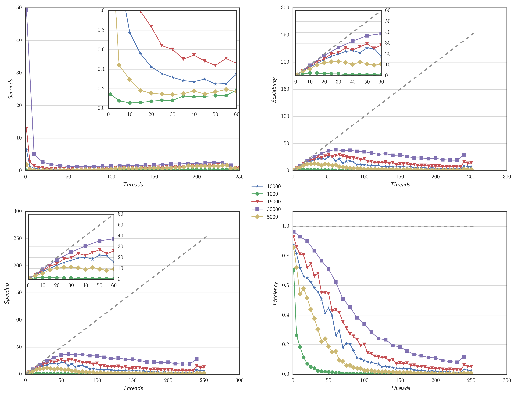
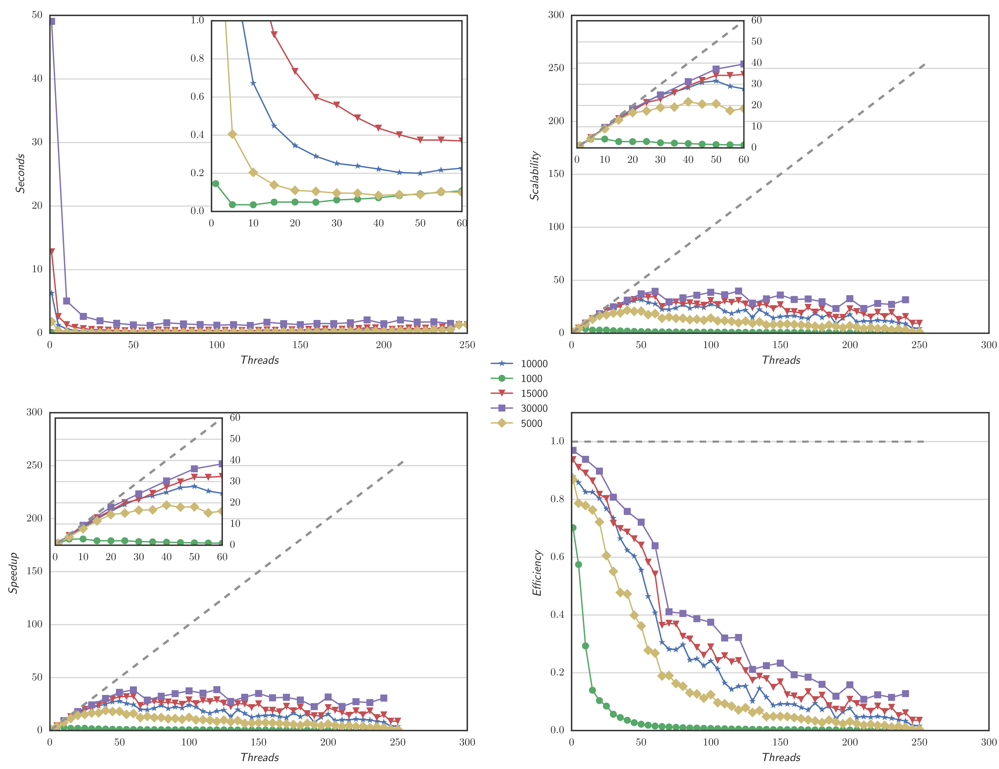

# Jacobi Iterative Method a Parallel Implementation
The aim of this project is to parallelize the Jacobi Iterative Method. 
We have implemented three versions of the code using C++, a sequential one and two parallel ones. 
The first parallel version has been implemented using FastFlow, and the second one using C++11 pthread. 
Each code version has been evaluated using different matrix sizes, and measures (e.g., Com- pletion Time, 
Scalability, Speed up, and Efficiency). All the conducted experiments
have been run using a Xeon Phi coprocessor, which has 60 cores with 4 contexts each, clocked at 1GHz.

## User Manual
###Compilation
There are there 3 makefile one for each architecture used for experiment and the testing. 
Each make generates the output file for the three version of the code (e.g., sequential, ParFor, and Thread). 
Then, we have the following:
- `make all`, to compile using g++, used in the local machine.
- `make -f makefile.XEON all`, used to compile in the Host machine
- `make -f makefile.PHI all`, used to compile in the PHI.
The executable generated are of the form `jacobiser[PHI]`, `jacobiFor[PHI]`, and `jacobiPar[PHI]` for the **sequential, 
**parallelFor, and **Thread version respectively. For each file, we also generate `.optrpt` which shows the 
full vectorization report. 

###Usage
An example for the file `jacobiParPHI` is the following:
```
./bin/jacobiserPHI 1000 500 0.001 250 10
```
Where the first argument is the matrix dimension, the second the maximum number of iteration, 
the third the \epsilon value, the forth the maximum number of worker, and the last is the 
step size for the worker (i.e., in this case 1, 10, 20, ..., 250 workers).

## Main results
The best completion time is obtained using the Pthread implementation, which makes us of a static decomposition
of the tasks. Instead the most efficent one is the FastFlow implementation, since it is using an dynamic scheduler
and it minimize the sync time.

The following Figures shows the obtained results using the two version of the code.


